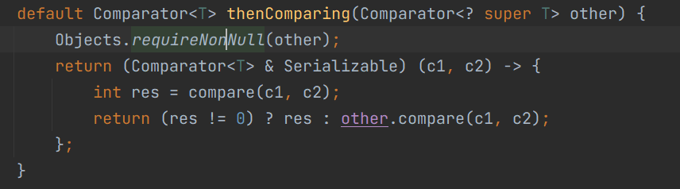

# 1. 泛型

## <? super T> &<? extends T>

博主说的没错但是略绕,举例来说比较容易理解: 

- `List<? extends Fruit> list` 你可以理解为这个list可能是`List<Apple>`也可能是`List<Orange>`或`List<Apple1>`,只要是Fruit或其子类就行, 这时候你要存入一个orange,有可能是往`List<Apple>`里存,这样是不行的,所以编译器判断不了你这个List是Apple还是Apple1还是Orange(因为都可以),所以就只能什么都不能存(null除外);
-  同理对于`List<? super Apple> list`,你可以理解为这个list可能是`List<Apple>`或`List<Fruit>`或`List<Object>`,所以编译器允许你存Apple或其子类,因为都能向上转型成功,但是你要存Fruit就不一定成功了,因为这个List可能是`List<Apple>`,编译器判断不了. 这样理解应该没错吧

PECS principle

- 如果要从集合中读取类型T的数据，并且不能写入，可以使用 ? extends 通配符；(Producer Extends)
- 如果要从集合中写入类型T的数据，并且不需要读取，可以使用 ? super 通配符；(Consumer Super)
- 如果既要存又要取，那么就不要使用任何通配符。
  

## 上下转型

# 2. 比较器

