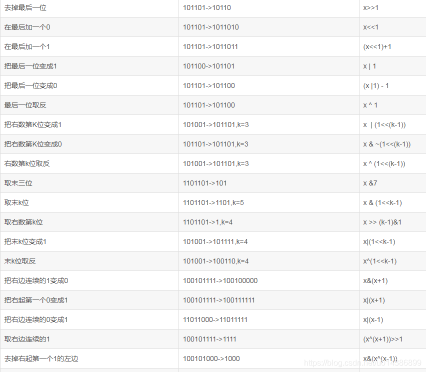

# bit

| Symbol | meaning           | 规则                 |
| ------ | ----------------- | -------------------- |
| &      | AND               | 同为1则为1， 其他为0 |
| \|     | OR                | 同为0则为0， 其余为1 |
| ~      | NOT               | 0 ->1  1 -> 0        |
| >>     | RIGHT SHIFT       | x / 2                |
| <<     | LEFT SHIFT        | x * 2                |
| ^      | XOR(exclusive or) | 不同为1，相同为0     |

